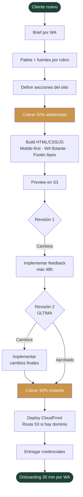
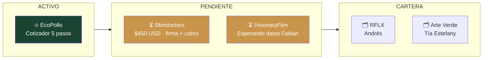
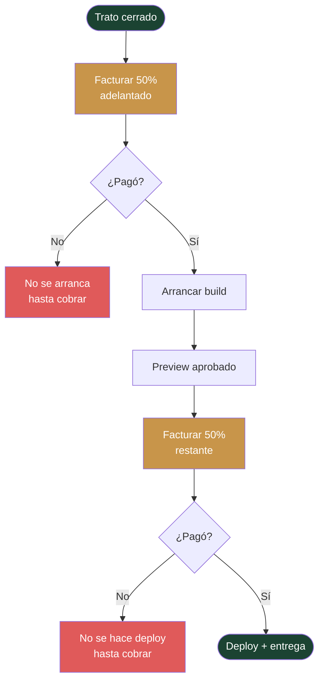
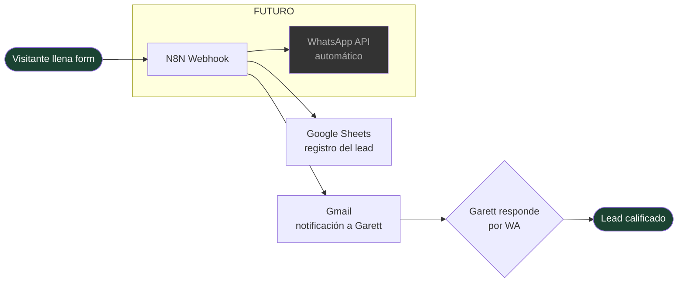
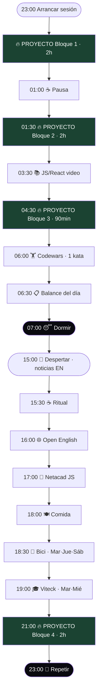
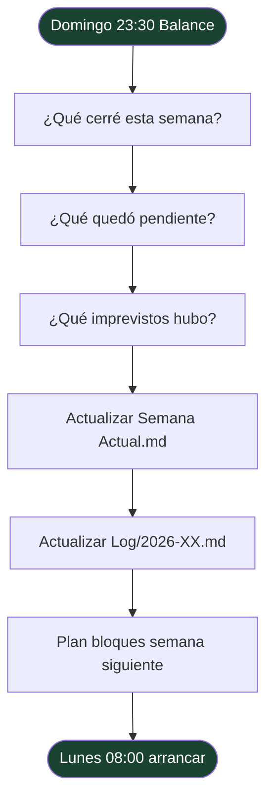
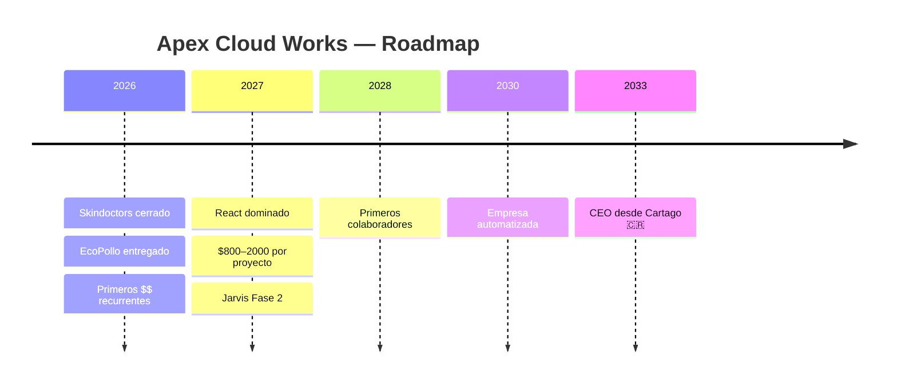

# Flujos Apex — Diagramas Visuales

> Abrí en modo Reading (`Ctrl + E`) para ver los diagramas renderizados.

---

## 1. Flujo completo de un proyecto

---

## 2. Pipeline de proyectos actuales

---

## 3. Flujo de cobro

---

## 4. Flujo de leads (N8N)

---

## 5. Rutina diaria — Madrugada v6.0

---

## 6. Flujo semanal (domingo)

---

## 7. Roadmap Apex

