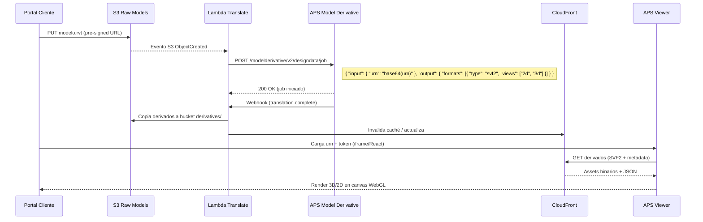

# ESTUDIO TÉCNICO Y DE NEGOCIO: VISUALIZADOR WEB APS VIEWER
## Apex Cloud Work — Línea AutoCAD/Arquitectura (Proyecto #10)

---

## 1. RESUMEN EJECUTIVO

| Métrica | Valor |
|---------|-------|
| **Producto** | Visualizador web 3D/2D para modelos BIM/CAD (Revit, AutoCAD, IFC, Navisworks) |
| **Tecnología core** | Autodesk Platform Services (APS) — Model Derivative API + Viewer SDK v7 |
| **Mercado objetivo** | Estudios de arquitectura/ingeniería en Costa Rica y Latam |
| **Modelo** | Add-on $150-300 USD + $50-100 USD/mes hosting |
| **Diferenciador** | Stack AWS propio + portal cliente integrado + deploy automático (Wilson) |
| **Time-to-MVP** | 4-6 semanas (Fase 1: prototipo funcional) |

---

## 2. ANÁLISIS DE MERCADO (COSTA RICA / LATAM)

### 2.1 Perfil de cliente ideal (ICP)

| Segmento | Tamaño típico | Pain points | Presupuesto mensual tech |
|----------|---------------|-------------|--------------------------|
| **Estudio arquitectura pequeño** | 2-8 pers. | Cliente no ve Revit; envía PDF/capturas; revisiones lentas | $100-300 |
| **Estudio mediano** | 10-30 pers. | Colaboración externa difícil; control versiones; presentaciones | $300-800 |
| **Constructor/Desarrollador** | 20-100+ | Coordinación BIM en obra; revisiones campo-oficina | $500-2000 |
| **Ingeniería civil/MEP** | 5-20 pers. | IFC/Navisworks sin visor ligero; clash detection visual | $200-600 |

### 2.2 Competencia directa

| Competidor | Modelo | Precio | Debilidad vs Apex |
|------------|--------|--------|-------------------|
| **Autodesk Construction Cloud (ACC)** | SaaS enterprise | $500-1500+/mes/usuario | Caro, complejo, overkill para estudios pequeños |
| **BIM 360 / Autodesk Docs** | SaaS | Incluido en ACC | Requiere licencias Revit completas |
| **Trimble Connect** | Freemium/SaaS | $0-25/usuario/mes | UI genérica, menos integración Revit nativa |
| **Dalux / Sablono / Procore** | SaaS construcción | $1000+/mes/proyecto | Enfoque obra, no diseño/presentación cliente |
| **Visores IFC gratuitos (BIMvision, xBIM, etc.)** | Desktop gratuito | $0 | Solo local, no web, no brandable, no compartible por link |
| **Speckle / Hypar / Giraffe** | Plataforma abierta/visual | Freemium + enterprise | Técnico, requiere dev, no "llave en mano" para arquitecto |

### 2.3 Ventana de oportunidad

- **Gap**: No hay solución "llave en mano" web + brandable + precio accesible para estudios pequeños/medianos en CR/Latam
- **Timing**: Post-COVID adopción BIM acelerada; clientes exigen visualización web
- **Regulación**: CFIA/INVU empiezan a pedir modelos BIM en trámites (oportunidad futuro)

---

## 3. ARQUITECTURA TÉCNICA DETALLADA

### 3.1 Diagrama de alto nivel

```
┌─────────────────────────────────────────────────────────────────────────────┐
│                           ARQUITECTURA APS VIEWER - APEX                      │
└─────────────────────────────────────────────────────────────────────────────┘

┌──────────────┐     ┌──────────────────┐     ┌─────────────────────────────┐
│   CLIENTE    │────▶│   PORTAL CLIENTE │────▶│        AWS STACK              │
│  (Arquitecto)│     │   (React + TS)   │     │                             │
└──────────────┘     └────────┬─────────┘     │  ┌────────────────────────┐  │
                              │               │  │   S3 BUCKETS           │  │
                              │ 1. Subida     │  │  ├── raw-models/       │  │
                              │    .rvt/.dwg  │  │  ├── derivatives/      │  │
                              │    .ifc/.nwd  │  │  └── viewer-assets/    │  │
                              │               │  └────────────────────────┘  │
                              │ 2. Trigger    │              │               │
                              │    Lambda     │              ▼               │
                              │               │  ┌────────────────────────┐  │
                              │               │  │   LAMBDA FUNCTIONS     │  │
                              │               │  │  ├── translate-model   │  │
                              │               │  │  ├── webhook-handler   │  │
                              │               │  │  ├── generate-token    │  │
                              │               │  │  └── cleanup-expired   │  │
                              │               │  └────────────────────────┘  │
                              │               │              │               │
                              │               │              ▼               │
                              │               │  ┌────────────────────────┐  │
                              │               │  │   AUTODESK APS         │  │
                              │               │  │  ├── Auth (OAuth 3-legged)│  │
                              │               │  │  ├── Model Derivative  │  │
                              │               │  │  │   ├── SVF2 translation│  │
                              │               │  │  │   ├── Thumbnails     │  │
                              │               │  │  │   ├── Properties     │  │
                              │               │  │  │   └── Metadata       │  │
                              │               │  │  └── Viewer SDK v7     │  │
                              │               │  └────────────────────────┘  │
                              │               │              │               │
                              │               │              ▼               │
                              │               │  ┌────────────────────────┐  │
                              │               │  │   CLOUDFRONT CDN       │  │
                              │               │  │  ├── derivatives/*     │  │
                              │               │  │  └── viewer-assets/*   │  │
                              │               │  └────────────────────────┘  │
                              │               │              │               │
                              │               │              ▼               │
                              │               │  ┌────────────────────────┐  │
                              │               │  │   ROUTE 53 + ACM       │  │
                              │               │  │  visor.{cliente}.apexcloud│  │
                              │               │  └────────────────────────┘  │
                              │               │                             │
                              │               └──────────────┬──────────────┘
                              │                              │
                              │ 3. Embed Viewer              │ 4. Link público
                              │    (iframe/React component)  │    (token temporal)
                              ▼                              ▼
┌─────────────────────────────────────────────────────────────────────────────┐
│                        CLIENTE FINAL (Navegador web)                          │
│  • Visualiza 3D/2D sin instalar nada                                         │
│  • Medición, sección, explode, propiedades, markup                           │
│  • Comentarios/anotaciones (opcional v2)                                     │
│  • Mobile responsive                                                         │
└─────────────────────────────────────────────────────────────────────────────┘
```

### 3.2 Stack tecnológico detallado

| Capa | Tecnología | Justificación |
|------|------------|---------------|
| **Frontend Portal** | React 18 + TypeScript + Vite | Tu stack actual (Semana 3 JS → React) |
| **UI Components** | shadcn/ui + Tailwind CSS | Consistente con Apex Landing + modular |
| **State Mgmt** | TanStack Query + Zustand | Server state + UI state ligeros |
| **Auth** | AWS Cognito (Hosted UI) | Integra con tu stack AWS; 3-legged OAuth para APS |
| **Backend** | Node.js 20 + Express (Lambda) | Runtime conocido; cold start aceptable |
| **APS SDK** | `@aps_sdk/authentication`, `@aps_sdk/model-derivative`, `@aps_sdk/viewer` | Oficiales, TypeScript nativo |
| **Infra** | AWS CDK (TypeScript) | IaC versionable; deploy via Wilson |
| **CI/CD** | GitHub Actions → AWS | Gratis para repo privado; integra Wilson |
| **Observabilidad** | CloudWatch + X-Ray | Nativo AWS; alertas en Wilson |

### 3.3 Flujo de traducción (Model Derivative API)



### 3.4 Formatos soportados (APS Model Derivative v2)

| Formato entrada | Extensiones | Salida SVF2 | Notas |
|-----------------|-------------|-------------|-------|
| **Revit** | .rvt, .rfa | ✅ 3D + 2D (vistas/láminas) | Principal objetivo |
| **AutoCAD** | .dwg, .dxf | ✅ 2D + 3D (layouts/model space) | Muy común en CR |
| **IFC** | .ifc, .ifczip | ✅ 3D (BIM abierto) | Estándar interoperabilidad |
| **Navisworks** | .nwd, .nwc | ✅ 3D (agregado) | Coordinación/Clash |
| **Rhino** | .3dm | ✅ 3D | Diseño paramétrico |
| **SketchUp** | .skp | ⚠️ Limitado | Vía export IFC/DWG |
| **OTROS** | .stp, .step, .iges, .sat, .fbx, .obj, .glb | ✅ 3D | Manufactura/visualización |

---

## 4. ESPECIFICACIÓN FUNCIONAL (MVP v1.0)

### 4.1 Portal Cliente (Arquitecto) — `portal/visor/`

| Módulo | Funcionalidad | Prioridad |
|--------|---------------|-----------|
| **Dashboard** | Lista modelos: nombre, estado (traduciendo/listo/error), fecha, tamaño, acciones | P0 |
| **Subida** | Drag & drop + pre-signed URL S3 (hasta 5GB); progreso; validación extensión | P0 |
| **Traducción** | Auto-trigger al subir; polling estado; reintento manual; logs error | P0 |
| **Visor embebido** | Iframe/React component APS Viewer; toolbar personalizada (brand Apex) | P0 |
| **Compartir** | Generar link público + token temporal (1h-30d); QR; expiración; revocación | P0 |
| **Configuración visor** | Vista inicial (3D/2D), fondo, unidades, toolbar visible, marca agua | P1 |
| **Gestión modelos** | Renombrar, eliminar, duplicar, mover a carpeta, metadatos personalizados | P1 |
| **Analytics básico** | Vistas únicas, tiempo sesión, dispositivo, país (CloudFront logs + Athena) | P2 |

### 4.2 Visor Cliente Final (Público) — `visor.{cliente}.apexcloudworkscompany.com`

| Feature | Detalle | Prioridad |
|---------|---------|-----------|
| **Carga modelo** | Desde urn + access token (URL params) | P0 |
| **Navegación 3D** | Orbit, pan, zoom, first-person, walk | P0 |
| **Navegación 2D** | Láminas Revit, layouts AutoCAD, capas on/off | P0 |
| **Toolbar** | Home, vistas guardadas, medir, sección, explode, propiedades, fullscreen | P0 |
| **Medición** | Distancia, ángulo, área, coordenadas; unidades configurables | P0 |
| **Propiedades** | Panel lateral: propiedades elemento seleccionado (BIM data) | P0 |
| **Sección** | Plano de corte X/Y/Z; caja de sección; invertir | P0 |
| **Explode** | Explosión progresiva modelo (solo 3D) | P0 |
| **Marca agua** | "Proyecto: {nombre} — {estudio} — Apex Cloud Work" (configurable) | P0 |
| **Responsive** | Mobile: touch gestures; tablet; desktop | P0 |
| **Tema** | Light/Dark/Auto; colores cliente (branding) | P1 |
| **Comentarios** | Anotaciones 3D/2D + hilo comentarios (v2) | P2 |
| **Markup** | Dibujar, texto, flechas, nubes; exportar PDF/imagen (v2) | P2 |
| **Offline** | Service Worker + Cache API (modelos <100MB) | P3 |

### 4.3 Admin Apex (Interno) — `admin/visor/`

| Feature | Detalle |
|---------|---------|
| **Gestión clientes** | CRUD estudios; planes; límites (modelos, storage, bandwidth) |
| **Monitoring** | Estado traducciones; errores APS; uso storage/bandwidth; costos AWS |
| **Billing** | Facturación mensual automática (Stripe/webhook → Sheets) |
| **Deploy Wilson** | `/deploy visor-cliente-{slug}` → CDK deploy stack dedicado |

---

## 5. ESTIMACIÓN DE COSTOS AWS (Mensual por cliente activo)

| Recurso | Uso típico | Costo USD/mes | Notas |
|---------|------------|---------------|-------|
| **S3 Standard** | 50 GB modelos + derivados | $1.20 | $0.023/GB |
| **S3 Requests** | 10k PUT/GET | $0.05 | Despreciable |
| **CloudFront** | 100 GB transferencia | $8.50 | $0.085/GB (Latam) |
| **Lambda** | 500k invocaciones, 1M GB-s | $2.50 | Traducción + tokens + webhooks |
| **API Gateway** | 500k requests | $1.75 | $3.50/M |
| **Cognito** | 50 MAU | $0.00 | Free tier 50k MAU |
| **CloudWatch Logs** | 5 GB ingesta | $2.50 | $0.50/GB |
| **Route 53** | 1 hosted zone + queries | $0.50 | Fijo |
| **APS Model Derivative** | 10 traducciones/mes | $0.00-15.00 | Free tier 500 credits/mes; luego $0.03/credit |
| **APS Viewer** | Incluido en créditos | $0.00 | |
| **TOTAL ESTIMADO** | | **$17-32/mes** | Margen amplio para precio $50-100/mes |

> **Nota**: APS da 500 créditos gratis/mes (≈166 traducciones SVF2). Costo real APS ≈ $0 para volúmenes normales.

---

## 6. PLAN DE DESARROLLO (6 SEMANAS — MVP)

### Semana 1: Fundaciones APS + Auth
- [ ] Crear app APS (developer.autodesk.com) → Client ID/Secret
- [ ] Configurar 3-legged OAuth + scopes: `data:read data:write data:create bucket:read bucket:create`
- [ ] Implementar `generate-token` Lambda (APS 2-legged para servidor + 3-legged para usuario)
- [ ] Test: obtener token → llamar `GET /oss/v2/buckets` → OK

### Semana 2: Subida + Traducción (Core)
- [ ] S3 bucket `raw-models` + pre-signed URL POST (Lambda authorizer Cognito)
- [ ] Lambda `translate-model`: S3 trigger → APS Model Derivative job (SVF2 + thumbnails + metadata)
- [ ] Webhook APS → Lambda `webhook-handler` → copiar derivados a `derivatives/{urn}/`
- [ ] Test end-to-end: subir .rvt → ver job en APS → derivados en S3

### Semana 3: Visor Básico (APS Viewer v7)
- [ ] Componente React `ApsViewer` (wrapper Viewer SDK)
- [ ] Carga por `urn` + `token` (URL params)
- [ ] Toolbar personalizada: home, views, measure, section, explode, properties, fullscreen
- [ ] Tema light/dark + marca agua configurable
- [ ] Responsive mobile (touch gestures)
- [ ] Test: modelos Revit, AutoCAD, IFC, Navisworks

### Semana 4: Portal Cliente (Arquitecto)
- [ ] Dashboard: lista modelos (Tabla → Cards mobile) con estado, acciones
- [ ] Subida drag&drop + progreso + validación (ext, tamaño)
- [ ] Compartir: modal link + token (expiración 1h/24h/7d/30d) + QR
- [ ] Configuración visor por modelo (vista inicial, toolbar, marca agua)
- [ ] Auth Cognito Hosted UI + protected routes

### Semana 5: Integración Stack Apex + Deploy
- [ ] CDK Stack dedicado por cliente (`VisorStack-{slug}`)
- [ ] Wilson command: `/deploy visor-cliente-{slug}`
- [ ] Subdominio `visor.{slug}.apexcloudworkscompany.com` + ACM cert
- [ ] Pipeline GitHub Actions → CDK deploy
- [ ] Migración portal actual (`portal/`) → integrar módulo visor

### Semana 6: QA + Documentación + Primer Cliente Piloto
- [ ] Test cross-browser (Chrome, Firefox, Safari, Edge)
- [ ] Test mobile (iOS Safari, Chrome Android)
- [ ] Test modelos grandes (500MB+ Revit, IFC complejos)
- [ ] Documentación cliente (guía uso + FAQ)
- [ ] Onboarding cliente piloto (Skindoctors? EcoPollo? Arquitecto conocido?)

---

## 7. RIESGOS Y MITIGACIONES

| Riesgo | Probabilidad | Impacto | Mitigación |
|--------|--------------|---------|------------|
| **APS cambia API / deprecaciones** | Media | Alto | Usar SDK oficial; pin versions; tests automatizados contra sandbox |
| **Costos APS escalan inesperadamente** | Baja | Medio | Alertas CloudWatch en créditos; límite mensual configurable por cliente |
| **Modelos grandes (>1GB) fallan traducción** | Media | Medio | Chunked upload; validación previa; splitting por disciplinas; timeout Lambda 15min |
| **Cliente final no puede ver en móvil (WebGL)** | Baja | Alto | Fallback a thumbnails 2D + propiedades; detectar WebGL support |
| **Competencia lanza precio bajo (Autodesk/Trimble)** | Media | Medio | Diferenciación: brandable, integrado portal, precio fijo, soporte local CR |
| **Dependencia vendor lock-in Autodesk** | Alta | Estratégico | Mantener abstracción en backend; evaluar Speckle/IfcJS como plan B largo plazo |
| **Seguridad: modelos confidenciales expuestos** | Baja | Crítico | Tokens cortos (1h default); CORS restrictivo; WAF; encriptación S3 SSE-KMS; auditoría acceso |

---

## 8. ROADMAP POST-MVP (v1.1 → v2.0)

| Versión | Features | Timeline |
|---------|----------|----------|
| **v1.1** | Comentarios/markup 3D-2D; notificaciones email; versionado modelos; comparar versiones | +4 sem |
| **v1.2** | Clash detection visual (Navisworks); BCF export; issues tracking; API pública | +6 sem |
| **v2.0** | Multi-proyecto; federación modelos; analytics avanzado (heatmaps vistas); white-label completo | +12 sem |
| **v2.1** | IA: auto-tagging elementos; búsqueda semántica ("muéstrame todas las vigas >5m"); resumen modelo | +16 sem |

---

## 9. PRÓXIMOS PASOS INMEDIATOS (Esta semana)

| Acción | Responsable | Entregable |
|--------|-------------|------------|
| 1. Crear cuenta APS + App | Garett | Client ID/Secret guardados en 1Password/Parameter Store |
| 2. Probar APS Viewer "Hello World" local (Vite + React) | Garett | Repo `aps-viewer-poc` funcionando con modelo sample |
| 3. Definir cliente piloto (1 estudio arquitectura real) | Garett + Derek | Nombre + contacto + modelo .rvt de prueba |
| 4. Estimar precio final add-on + mensualidad | Garett | Propuesta comercial v0.1 |
| 5. Crear repo `apex-aps-viewer` + CDK stack base | Garett | `main` branch + GitHub Actions scaffold |

---

## 10. APÉNDICE: RECURSOS TÉCNICOS CLAVE

### APS Viewer - Componentes clave (v7)

```typescript
// Inicialización básica
import { Viewer3D, GuiViewer3D } from '@aps_sdk/viewer';

const viewer = new GuiViewer3D(document.getElementById('viewer'), {
  extensions: ['Autodesk.Measure', 'Autodesk.Section', 'Autodesk.Explode'],
  theme: 'light-theme', // o 'dark-theme'
  language: 'es',
});

// Cargar modelo
viewer.start('urn:...', {
  accessToken: 'eyJhbGciOiJIUzI1NiIs...',
  documentId: 'urn:...',
});

// Eventos útiles
viewer.addEventListener(Autodesk.Viewing.GEOMETRY_LOADED_EVENT, () => {});
viewer.addEventListener(Autodesk.Viewing.SELECTION_CHANGED_EVENT, (e) => {
  const dbId = e.dbIdArray[0];
  viewer.getProperties(dbId, (props) => console.log(props));
});
```

### Model Derivative - Job payload (SVF2 completo)

```json
{
  "input": { "urn": "dXJuOmFkc2sub2JqZWN0czpvcy5vYmplY3Q6bXktYnVja2V0L21vZGVsLnJ2dA" },
  "output": {
    "formats": [
      { "type": "svf2", "views": ["2d", "3d"] },
      { "type": "obj", "advanced": { "modelGuid": "..." } }
    ],
    "advanced": {
      "generateMasterViews": true,
      "exportFileStructure": "single"
    }
  }
}
```

### CDK Stack patrón (por cliente)

```typescript
// lib/visor-stack.ts
export class VisorStack extends cdk.Stack {
  constructor(scope: Construct, id: string, props: VisorStackProps) {
    super(scope, id, props);

    // S3: raw + derivatives + viewer assets
    const rawBucket = new s3.Bucket(this, 'RawModels', { ... });
    const derivBucket = new s3.Bucket(this, 'Derivatives', { ... });

    // Lambda: translate + webhook + token
    const translateFn = new lambda.Function(this, 'TranslateModel', { ... });
    rawBucket.addEventNotification(s3.EventType.OBJECT_CREATED, new destinations.LambdaDestination(translateFn));

    // CloudFront + Route53
    const distribution = new cloudfront.Distribution(this, 'ViewerCDN', { ... });
    new route53.ARecord(this, 'VisorDomain', {
      zone: props.hostedZone,
      recordName: `visor.${props.clientSlug}`,
      target: route53.RecordTarget.fromAlias(new targets.CloudFrontTarget(distribution))
    });

    // Cognito User Pool Client (dedicado por cliente)
    const userPoolClient = new cognito.UserPoolClient(this, 'ClientPortal', { ... });
  }
}
```

---

## 11. CONCLUSIÓN Y RECOMENDACIÓN

**Viabilidad: ALTA**

- ✅ Tecnología madura (APS Viewer v7 estable, SDK TypeScript)
- ✅ Costos AWS predecibles y bajos ($17-32/mes/cliente)
- ✅ Margen amplio: precio $50-100/mes → 65-80% margen bruto
- ✅ Stack 100% alineado con tu infra actual (S3, CloudFront, Lambda, CDK, Cognito)
- ✅ Diferenciación clara vs competencia: brandable, integrado, precio fijo, soporte local
- ✅ Derek como socio técnico futuro (arquitectura) da credibilidad dominio

**Recomendación**: **Arrancar Fase 1 ya (Semana 1-2)**. El mayor riesgo es validación mercado, no técnica. Conseguir 1 cliente piloto real en semanas 4-6 valida el negocio antes de invertir en features avanzadas.

**Próxima acción concreta**: Crear app APS + POC local Viewer esta semana (2-3 horas). Si funciona → planificar 6 semanas MVP.

---

*Documento generado: 09 Julio 2026 | Versión 1.0 | Apex Cloud Work*