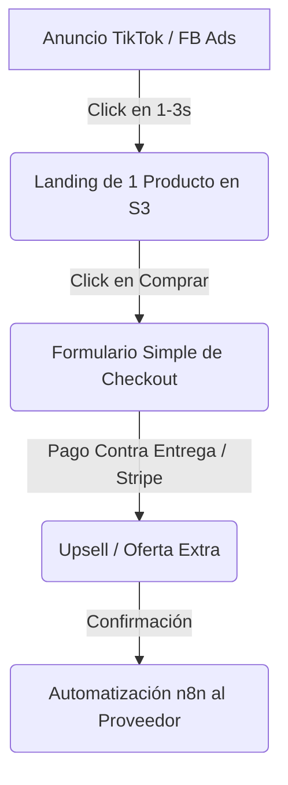

# 📦 Dropshipping: Guía Operativa y Técnica para Desarrolladores

Esta guía está diseñada para entender la maquinaria real del dropshipping, descartando el ruido de los "gurús" de marketing y enfocándose en la infraestructura, la economía real y la ventaja técnica de operar como desarrollador.

---

## 1. La Realidad del Modelo (Sin Filtro)

El dropshipping es un negocio de **arbitraje de atención y logística**, no de comercio electrónico tradicional. Tu trabajo no es almacenar productos, sino comprar tráfico barato (anuncios) y convertirlo en ventas caras, delegando el envío al proveedor.

### Los Números Reales (La Regla del 3x)
Para que un producto sea viable, su precio de venta al público (PVP) debe ser al menos **3 veces su costo de envío y producto (COGS)**.
*   **1/3 (COGS):** Costo del producto + envío.
*   **1/3 (CPA - Costo por Adquisición):** Lo que le pagas a Facebook/TikTok Ads para conseguir una venta.
*   **1/3 (Margen):** Tu ganancia bruta (de aquí restas pasarelas de pago, devoluciones y suscripciones).

> ⚠️ **Margen Neto Real:** Un dropshipper experimentado opera con un margen neto final de entre **15% y 25%**. Si vendes $10,000 al mes, te quedan $1,500 - $2,500 en la bolsa.

---

## 2. Ventaja Competitiva como Dev (El Enfoque Apex)

La mayoría de dropshippers usan plantillas genéricas de Shopify cargadas de apps lentas que matan la tasa de conversión. Tu ventaja competitiva es técnica:

### A. Velocidad de Carga Absoluta
*   **Problema:** Una tienda Shopify promedio tarda 3-5 segundos en cargar en móviles. Cada segundo extra reduce la conversión un 20%.
*   **Solución Apex:** Landings estáticas ultra-rápidas en **HTML/CSS/JS** alojadas en **AWS S3 + CloudFront**. Carga instantánea (<1s).
*   **Estrategia:** En lugar de una tienda con 100 productos, creas una landing de **un solo producto ganador** con checkout integrado.

### B. Automatización con n8n
En lugar de pagar apps mensuales en Shopify para sincronizar pedidos, usas tu servidor de **n8n**:
1.  **Webhook de compra:** Captura los datos del cliente desde tu formulario de checkout personalizado.
2.  **Base de Datos:** Guarda el lead en Google Sheets o PostgreSQL para remarketing por email.
3.  **Procesamiento:** Si usas un proveedor con API (como CJ Dropshipping), n8n puede enviar el pedido y pagar automáticamente.
4.  **Notificación:** Te envía a vos un mensaje de Telegram/WhatsApp con la venta y el margen neto exacto al instante.

### C. Métodos de Pago Locales (Costa Rica / Latam)
*   En Latam, la fricción de ingresar la tarjeta en una web desconocida es del 80%.
*   **Solución:** Implementar checkout con **Pago Contra Entrega (COD - Cash on Delivery)** o **Sinpe Móvil** en el checkout de la landing.
*   *¿Cómo funciona dropshipping con COD?* Importas stock pequeño a Costa Rica (50-100 unidades del producto ya validado) y usas Correos de Costa Rica o encomiendas para cobrar en la entrega. La conversión sube hasta 5 veces comparado con tarjeta de crédito en línea.

---

## 3. El Embudo de Conversión (La Máquina de Ventas)

1.  **Tráfico:** Videos de 15 segundos en TikTok Ads o Meta Ads mostrando el producto resolviendo un problema cotidiano.
2.  **Landing Page:** Copy directo al dolor, gifs del producto funcionando, testimonios, oferta con límite de tiempo y botón de acción gigante.
3.  **Checkout:** Un solo paso. Pedir solo los datos necesarios (Nombre, Teléfono, Provincia, Dirección exacta).

---

## 4. Proveedores y Logística

| Proveedor | Tiempos de Envío (Latam) | Ventajas | Desventajas |
| :--- | :--- | :--- | :--- |
| **AliExpress** | 20 - 45 días | Millones de productos, precios bajos. | Tiempos de envío pésimos, empaques feos. |
| **CJ Dropshipping** | 10 - 20 días | Integración por API, empaques personalizados. | Costos de envío ligeramente más altos. |
| **Zendrop / AutoDS** | 8 - 15 días | Soporte en inglés, agentes confiables. | Requieren planes de pago para mejores funciones. |
| **Agente Privado (China)** | 7 - 12 días | Mejor precio, control de calidad real. | Requieren un volumen mínimo de pedidos (ej. 10+ diarios). |

---

## 5. Plan de Acción para Iniciar (Fase 1: Validación)

No gastes semanas construyendo una tienda. Sigue este proceso ágil:

1.  **Encuentra 3 productos candidatos:** Que resuelvan un problema, tengan factor "wow" y se puedan vender a más de $25 USD.
2.  **Diseña una Landing Simple:** Crea un subdirectorio en S3 (`dropship.apexcloudworkcompany.com/producto/`). Usa HTML limpio y CSS rápido.
3.  **Monta un checkout de n8n:** Un formulario simple que recopile los datos y los envíe a una hoja de Google Sheets.
4.  **Crea 3 creativos de video:** Descarga videos existentes de TikTok/Pinterest, edítalos y hazlos tuyos.
5.  **Prueba de Tráfico ($20 USD):** Corre una campaña de TikTok Ads o Facebook Ads enfocada a conversiones durante 2 días.
    *   *Si no hay ventas:* El producto o la landing no sirven. Apaga y pasa al siguiente.
    *   *Si hay ventas y el CPA es menor al margen:* Tienes un ganador. Procesa los pedidos manualmente en AliExpress/CJ y escala el presupuesto de anuncios.
